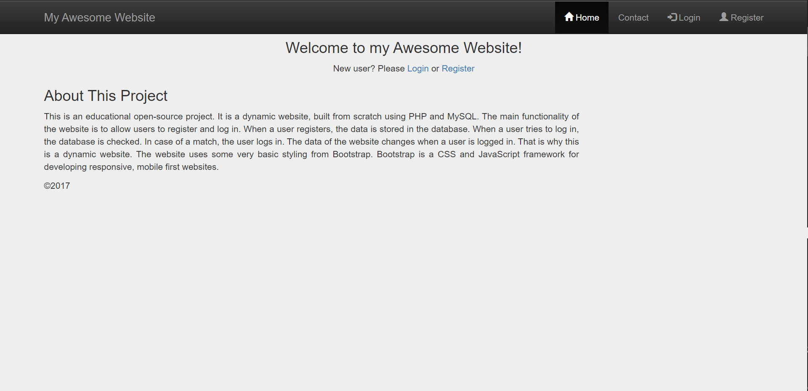

# php-powered-forum
# 效果图


PHP/MySQL Powered Forum.

A sample Forum.

此论谈需要数据库需求：

Creating Database Tables

`
CREATE database db_1;
`

`
use database db_1;
`
```
CREATE TABLE IF NOT EXISTS `user` (
`id` int(11) NOT NULL AUTO_INCREMENT,
`username` varchar(50) NOT NULL,
`email` varchar(50) NOT NULL,
`password` varchar(50) NOT NULL,
`trn_date` datetime NOT NULL,
PRIMARY KEY (`id`)
);

```

